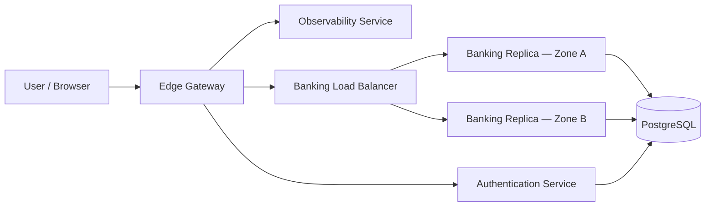

# Distributed Banking System

An academic banking platform built to demonstrate core distributed-systems ideas: running across multiple zones, staying available when parts fail, keeping money transfers correct, and protecting user access.

This is not a full commercial bank. It provides a small set of features so the focus stays on how the system behaves under failure, retry, and multi-node deployment.

---

## What the System Does

### For regular users

- **Register** — Create an account with a username, email, and password.
- **Log in** — Sign in and receive an access token for later requests.
- **View balance** — See the balance of your single bank account (each user has one account).
- **Transfer money** — Send money to another valid user account.

### For administrators

- **Observability dashboard** — View health status of system nodes and zones.
- **Traffic routing (cloud)** — On GCP Cloud Run, admins can shift traffic between banking replicas to simulate zone failover.

Every successful API response includes **metadata** showing which node and zone handled the request. This makes it easy to see load balancing and failover in action during demos and tests.

---

## System Overview

The platform is split into separate services:

| Service | Role |
|---------|------|
| **Authentication** | Registration, login, token verification, user roles |
| **Banking** | Balances and money transfers (runs as two replicas in HA mode) |
| **Observability** | Health monitoring and admin routing controls |
| **UI** | Web frontend for users and admins |

Traffic flows through a gateway and load balancer before reaching the banking replicas:



**Local development** uses Docker Compose. **Cloud deployment** uses GCP Cloud Run with two banking replicas in different regions. See `infra/README.md` and `infra/CLOUD_RUN_DEPLOYMENT.md` for setup details.

---

## Distributed Systems Properties

The rest of this document explains how the project addresses availability, fault tolerance, and security. These are the main non-functional goals of the course project.

---

## Availability

**Availability** means the system keeps working even when some parts are down or slow.

### Multiple replicas across zones

The banking API runs as **at least two replicas**, each tagged with its own zone (for example `zone-a` and `zone-b`). A load balancer spreads incoming requests across healthy replicas.

- **Local HA mode** (`docker-compose.local-ha.yml` and `docker-compose.cloud.yml`): NGINX distributes traffic between two banking containers.
- **GCP Cloud Run**: Two banking services (`banking-banking-a` and `banking-banking-b`) receive traffic through Cloud Run traffic splitting.

If one replica stops, the other can still serve balance checks and transfers.

### Load balancing without code changes

Adding or removing banking nodes is done through **infrastructure configuration** (Compose files, NGINX upstream lists, or Cloud Run traffic weights), not by changing application code. This supports horizontal scaling as an operational concern.

### Health checks

Each service exposes a `/health` endpoint. The banking service checks its own dependencies (database and authentication service) and reports `HEALTHY` or `UNHEALTHY`.

The observability service periodically probes configured endpoints and shows status in the admin dashboard. If a probe fails or times out, the node is marked `UNHEALTHY` or `UNKNOWN`.

### Retries on internal calls

When banking or observability services call the authentication service, they use configurable timeouts and retries:

- Timeout, max retries, and backoff are set via environment variables (defaults documented in `infra/README.md`).

This reduces the impact of brief network glitches between services.

### Graceful degradation of observability

If a node cannot be reached for health probing, the admin view shows `UNKNOWN` rather than silently pretending everything is fine. Stale or missing telemetry is visible to operators.

---

## Fault Tolerance

**Fault tolerance** means the system handles failures correctly — not just staying up, but also avoiding wrong financial outcomes.

### Idempotent transfers

Network timeouts and retries are common in distributed systems. Without protection, a client might send the same transfer twice and debit the sender twice.

This project prevents that with **idempotency keys**:

1. Every transfer request must include an `Idempotency-Key` header.
2. The first time a key is seen, the transfer runs and the result is stored.
3. If the same key is sent again, the stored result is returned — no second debit or credit.

If someone reuses a key with a **different** transfer payload, the system rejects the request. This stops accidental or malicious key reuse.

### Atomic database transactions

A transfer updates two account balances (debit source, credit destination). These updates run inside a **single database transaction** with row-level locking (`SELECT … FOR UPDATE`). Either both balances change, or neither does. There are no partial transfers left in the database.

Database rules also enforce:

- Balances cannot go negative.
- Transfer amounts must be positive.
- Source and destination accounts must differ.

### Strong consistency for financial data

Account balances and transfer records live in **PostgreSQL**. The design targets **strong consistency**: all replicas read and write through a shared primary database so balance data stays coherent.

In cloud layouts, the database layer supports:

- TLS connections (`DB_SSL`)
- Cloud SQL Unix socket paths (`DB_SOCKET_PATH`)

PostgreSQL replication nodes (`postgres-replica-a`, `postgres-replica-b` in the cloud compose file) model a multi-node data tier across zones. The primary is the source of truth; replicas support the replication story required by the project spec.

### Continuing service during zone failure

When one zone or replica fails:

- Traffic routes to remaining healthy replicas via the load balancer or Cloud Run traffic weights.
- Transfers that already completed remain safe because outcomes are persisted and keyed by idempotency key.
- Clients can retry with the same idempotency key after a timeout without creating duplicate transfers.

On GCP, admins can use the observability API to shift all traffic away from a failed replica (`POST /admin/nodes/routing`), simulating failover during demonstrations.

### Recovery logging

The data model includes a **recovery log** for tracking events that may need synchronization when a node comes back online (for example after a zone outage). This supports the project’s recovery narrative: unavailable nodes can catch up after connectivity returns.

### Response metadata for verification

Every API response includes:

```json
{
  "metadata": {
    "nodeId": "banking-api-zone-a-1",
    "zone": "zone-a",
    "timestamp": "2026-07-03T19:00:00.000Z"
  }
}
```

During failover tests, you can confirm which replica handled each request without digging into server logs.

---

## Security

**Security** here focuses on access control, protected communication, and safe boundaries between services.

### Authentication and sessions

- Users log in with email and password.
- On success, the authentication service issues an **access token**.
- Protected endpoints require `Authorization: Bearer <token>`.

Banking and observability services do not trust tokens on their own. They call the authentication service’s internal verify endpoint to validate each request.

### Role-based access control

Each user has a role: `user` or `admin`.

| Action | Required role |
|--------|---------------|
| Register, login, view balance, transfer | `user` or `admin` |
| View node health dashboard | `admin` only |
| View or change traffic routing | `admin` only |

Non-admin users receive `403 Forbidden` if they try to access admin observability endpoints.

### Service-to-service protection

Internal authentication endpoints (token verification, user lookup) are guarded by an **internal API key** (`x-internal-api-key` header). Only trusted services that know the shared key can call these endpoints. This keeps user identity verification centralized in the authentication service.

### Encrypted communication in transit

The project requires encrypted traffic between clients and services, and between services:

- **Cloud Run** serves traffic over HTTPS by default.
- **Database connections** support TLS via `DB_SSL` and related settings.
- **Local/cloud compose** can terminate TLS at the edge gateway (ports 80/443 in the cloud layout).

End-to-end encryption in transit is a stated project requirement; production deployments should always enable TLS on public endpoints and database links.

### Input validation

Registration, login, and transfer requests are validated before processing (required fields, valid amounts, valid destination users). Invalid transfers are rejected with clear errors instead of reaching the ledger.

### Operational note on passwords

Password handling in this academic project uses a simplified storage approach suitable for demos. A production system would use proper password hashing (for example bcrypt or Argon2), secret management, and stricter token standards (for example signed JWTs with expiry). The architecture — separate auth service, token verification, RBAC — is the pattern that would carry over to production.

---

## How the Properties Work Together

Consider a transfer during a partial outage:

1. The user sends a transfer with an idempotency key.
2. The load balancer forwards the request to a banking replica in zone A.
3. The replica verifies the token with the authentication service (with retries if needed).
4. The transfer runs in one database transaction and the outcome is stored under the idempotency key.
5. The response tells the user which node and zone handled the request.

If the response never arrives (timeout), the user retries with the **same idempotency key**. The system returns the original outcome — availability for the client, fault tolerance for the money, and security because only the authenticated owner can transfer.

If zone A goes down, traffic moves to zone B. New requests still work; retries still deduplicate correctly.

---

## Running the Project

**Simple local mode** (single banking node):

```bash
docker compose -f infra/docker/docker-compose.local.yml up -d --remove-orphans
```

**Local high-availability mode** (two banking nodes + load balancer):

```bash
docker compose -f infra/docker/docker-compose.local-ha.yml up -d --remove-orphans
```

**Validate load balancer failover**:

```bash
infra/scripts/validate-load-balancer-ha.sh
```

**Deploy to GCP Cloud Run**:

```bash
infra/scripts/deploy-gcp-from-env.sh
```

See `specs/001-distributed-banking-system/quickstart.md` for a full walkthrough including registration, transfer, and failover scenarios.

---

## Further Reading

| Document | Contents |
|----------|----------|
| `specs/001-distributed-banking-system/spec.md` | Full requirements and acceptance scenarios |
| `specs/001-distributed-banking-system/plan.md` | Architecture and technical decisions |
| `infra/README.md` | Docker Compose modes and environment variables |
| `infra/CLOUD_RUN_DEPLOYMENT.md` | GCP deployment guide |
